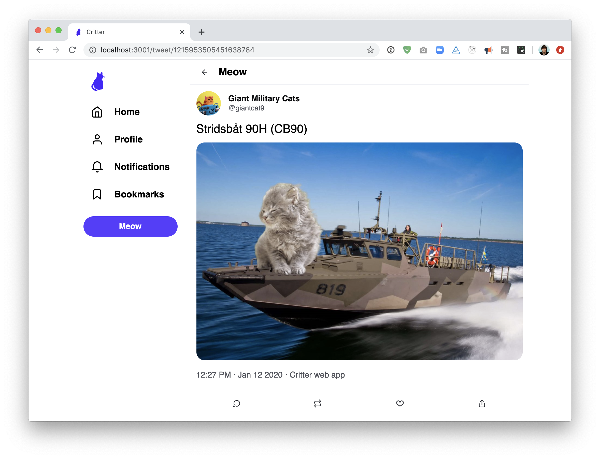
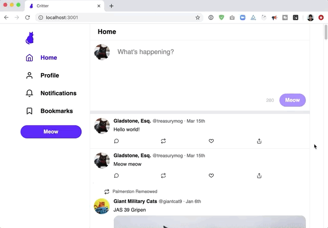
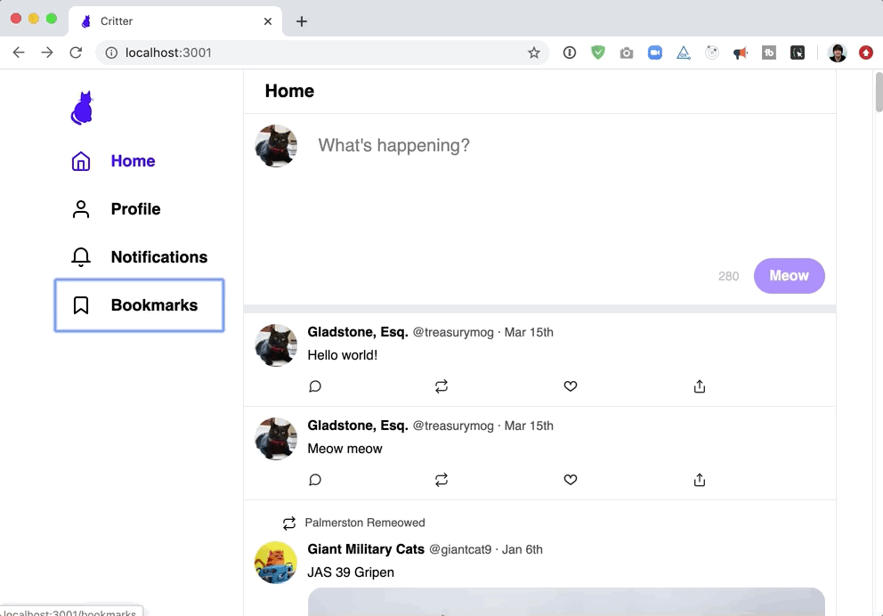
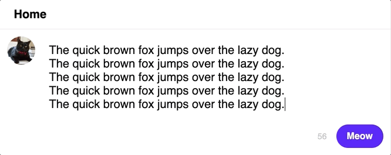

# Twitter project

This project asks you to create a Twitter clone, "Critter":

Your focus will be on the front-end: an API is provided, and documented in `server/API_DOCS.md`. You can read this document thoroughly to build an understanding of what the different endpoints are, and how they work.

---

## Initial setup

### The Server

A folder is provided, `/server`, with the backend code. This is a local server that you will connect to to retrieve/write the data.

#### Install the backend dependencies

1. Navigate to the server folder `cd server`
2. Install the required packages `yarn install`

And that's it for the backend! No editing the code in server at all.

#### Install React for the frontend

You'll need to create the front-end using `create-react-app`. Run the following from _within the main workshop directory_:

1. If you just installed the server dependencies, you'll need to `cd ..` to get back to the main project directory.
2. Run the following command `npx create-react-app client`. This will create a new folder called `client` in the project. ALL of the work for this project will be done in there.
3. There are some additional dependencies that you will need for the project. Navigate the client folder. `cd client`
4. Install the following dependencies with `yarn`:

- styled-components
- react-router-dom
- react-icons
- moment

After they're installed, you can run `yarn start` to start the front-end application.

You can find instructions for running the server application in `serverAPI_/DOCS.md`

The cat silhouette logo is provided in `assets/logo.svg`

---

## Twitter crash course

If you're not familiar with Twitter, this section helps describe the app we're building a clone of.

Twitter is a social network/"micro-blogging" platform. You must be registered to post, but tweets are public and can be seen by non-registered users. Every twitter user chooses a username, often called a "handle". Conventionally, the handle is prefixed with an "@" symbol (eg. `@misswhatever`).

A "tweet" is a post, limited to 280 characters. Tweets can include media like photos or videos. Our clone will have limited media support.

Every profile has a "feed". A feed is a series of tweets. A user's profile feed shows all of the tweets they've posted, plus all of the tweets they've shared.

Users can follow each other. Unlike friends on facebook, following does not require mutual consent.

Every user has a "home feed". The home feed is a list of tweets that have been posted by the people that you follow. If you follow 100 accounts, your home feed will be a stream of tweets from those 100 people, along with things that those 100 people choose to "retweet".

A retweet is a way of sharing a tweet. If I follow `@koolkat`, and Kool Kat really likes Metallica, I may start seeing Metallica tweets in my home feed if Kool Kat retweets them.

---

## Functionality

Your application should include the following features:

### View a single tweet



When the user navigates to `/tweet/:tweetId`, they should see the details for the specified tweet.

### View a "home feed"

When navigating to the root URL `/`, the user should see a list of tweets from the accounts that the current user follows.


### View a profile page

When navigating to `/:profileId`, information about that user is displayed, above a list of that user's tweets (and retweets):


### Liking a tweet

When clicking the "like" button, it should increment the # of likes. Clicking again should "unlike" the tweet.


### Posting a new tweet

On the homepage, the user should be able to create a new tweet by writing in the box and clicking "Meow":


It should show up in the feed below after posting.

---

## Not required

A fully-functional Twitter clone would have many other features that we won't be tackling:

- Any other pages, like "Notifications" and "Bookmarks". We'll create routes for them, but they won't have any content.
- Following / unfollowing users
- The "Meow" button in the sidebar.
- Retweeting
- Replying to tweets
- The other tabs on the profile page (Media / Likes)
- Attaching media to new tweets
- The "share" / "upload" button on tweets (only the "like" button should do anything)

Some of these features are optional stretch goals. For more information, see `STRETCH.md` once you have completed all the primary objectives.

--

# Getting started

There are many valid ways to accomplish this project. The following is just one example of a way this could work.

## Routes

First thing's first, the create-react-app code includes some placeholder content. We can delete most of it. We'll keep `src/index.js` and `src/App.js`, though let's turn App into a clean slate:

```js
import React from "react";

const App = () => {
  return <div>Hello world</div>;
};
```

Next, let's create some top-level components. We won't actually be creating views for the "Bookmarks" and "Notifications" shown in the sidebar, but we'll create placeholders for them. Create the following components, each in their own file:

- `HomeFeed`
- `Notifications`
- `Bookmarks`
- `TweetDetails`
- `Profile`

Each of these components can start as a placeholder, like `App`:

```js
const HomeFeed = () => {
  return <div>Home Feed</div>;
};
```

Next, let's add routes to all of these components! Import React Router, add a `<Switch>`, and add the following routes:

- `/` (home route)
- `/notifications` (notifications route. We won't be building this view, but let's add the route anyway.)
- `/bookmarks` (another route we won't do much with)
- `/tweet/:tweetId` (tweet route)
- `/:profileId` (profile route)

> It's important to put them in this order, within a Switch. **`/:profileId` should come last!** This is because it's the "loosest" route; `/notifications` _could_ match, since maybe there's a user with the username "notifications"

### Styles and constants

In our clone, a bright purple is used in a lot of different places. To reduce duplication, let's create a file, `src/constants.js`. We can export an object with the colors we'll need:

```js
export const COLORS = {
  // Bright purple:
  primary: "hsl(258deg, 100%, 50%)",

  // Add more colors as needed!
};
```

We can also create a new `GlobalStyles` component to hold our app-wide styles, and use it in `App`. You can apply a CSS reset here, and set global fonts (for this project, `sans-serif` works well!).

This app uses many icons. You can find everything you'll need using react-icons. Here's a list of all icons in the "Feather" collection: https://react-icons.github.io/react-icons/icons?name=fi

### Layout

Create a `Sidebar` component. We'll need the cat logo shown in the top left, which we can move from `assets/logo.svg` (in the root directory of this workshop) to `src/assets/logo.svg`. Import it, and create links for all the navigation items in the sidebar, using React Router `<Link>`. For the `Profile` link, for now you can use a dummy profile ID (eg. `/profile/abc`).

Use CSS to position the sidebar beside all the routes.

You should now be able to click between different links in the left sidebar, which loads different (mostly empty) routes on the right:


You'll notice that the "active" route is coloured purple. To achieve this, you can use the NavLink component from React Router. The library will append an `.active` class to the current route's link. You can wrap it with styled-components, and use the `.active` selector to apply a color:

```js
import { NavLink } from "react-router-dom";

import { COLORS } from "../constants";

const NavigationLink = styled(NavLink)`
  /* default styles here */

  &.active {
    color: ${COLORS.primary};
  }
`;
```

> **Important:** You don't need to nail the aesthetic right off the bat. A very loose interpretation is fine for now. The most important thing is to focus on getting all the right pieces in place; you can polish everything later on.

# Fetching user data

Next, we need to get information about the current user!

The API makes information available at `/me/profile`. We'll want to fetch the data from the API, and store it in React state. We'll make that state available anywhere in the app using Context.

Create a new component, `CurrentUserContext`. Refer to the Context lectures and workshops for a refresher on how context components work. We'll want to use the `fetch` API, and store the data we receive.

The thing is, for the first second or so, we don't know who the user is, and this actually makes things more complicated! For example, the sidebar features a link to "Profile", which is meant to be a link to the current user's profile; if we don't know who the user is, we can't very well link to their profile!

We need a _loading state_.

You can either use two state hooks, or a reducer hook; the choice is yours. Here's how two state hooks could be set up:

```js
export const CurrentUserProvider = ({ children }) => {
  const [currentUser, setCurrentUser] = React.useState(null);
  const [status, setStatus] = React.useState("loading");

  // Fetch the user data from the API (/me/profile)
  // When the data is received, update currentUser.
  // Also, set `status` to `idle`

  return (
    <CurrentUserContext.Provider value={{ currentUser, status }}>
      {children}
    </CurrentUserContext.Provider>
  );
};
```

You can wrap the provider around the app in `src/index.js`, and consume it in `App`. If the `status` is `loading`, we can show a loading message instead of rendering all the routes.

# Next steps

At this point, we have our routes, we have our user, and an example of data fetching. These are the patterns we'll want to rely on as we continue building out the app!

As a next step, you can start working on the index "home feed" route. Go through the API documentation to find the right API endpoint, and update the `HomeFeed` component to fetch the data and use the results to render an array of Tweets. You'll need to create a Tweet component that takes the data for a single Tweet, and renders the appropriate UI.

Again, don't worry too much on the styling at first. More important to get the logic working.

Beyond that, it's up to you to keep putting the app together, 1 component at a time!

Your next steps are up to you. The rest of this document outlines specific necessary features and "gotchas" surrounding them, but it's up to you to decide what order to do things in, and how to solve the problems you encounter.

# Requirements and Gotchas

### Tweet Components

There are two different Tweet components: a big one, used on the Tweet Details page, and a small one, to be used in different feeds.


You'll notice that these tweets share some UI elements in common, whereas other are different. If you try to create a single `Tweet` component, it will get awfully complicated. Might be better to have two separate components, but to share reusable bits (eg. maybe a `TweetActions` component for the row of icons along the bottom, since it's identical in both versions).

### Click targets

Twitter does something a little peculiar when it comes to click targets. Notice how the card itself is a link to the "tweet details" page, and yet the user's display name is a link to that user's profile:



Making matters more complicated, the entire thing is keyboard-navigable:



We are not allowed to nest links inside links. So how is this possible?

We need to break one of our golden rules: we need to add click-handlers to a non-anchor and non-button.

Normally, we would never do this, but we don't have much choice in the matter. There are some things we need to do to make it work, though:

- Since we can't use a `<Link>` from React Router, we'll need to navigate the user using the `history` utility. Check out the [React Router docs](https://reacttraining.com/react-router/web/api/Hooks/usehistory) for more info.
- Make sure the div has `tabIndex="0"`, so that it can be tabbed to with a keyboard
- Add an `aria-label` for screen readers, something like "View tweet".
- Make sure to handle keypresses as well as clicks; if the user presses "enter" with this tweet focused, it should redirect the user.

### Retweets

A "retweet" is a way for one user to share another user's tweets with their followers.

Actually performing a retweet is beyond the scope of this project, but we need to display retweets returned by the API.

For example, when viewing the `treasurymog` profile, the following tweet is shown:


This tweet is written by the `diplomog` account, but shows up in the `treasurymog` profile feed, since `treasurymog` retweeted it.

If a specific tweet is retweeted, it will have data in the `retweetFrom` part of the JSON object. You can use this data to show the little "retweeted by" header.

### Character limit

Twitter allows tweets up to 280 characters. You should display a "remaining characters" indicator, which shifts colors as the user approaches/surpasses the limit:



Specifically, here are the rules:

- Should become yellow when 80% of the limit is used up (55 characters remaining)
- Should become red when the number dips into the negatives.
- Should not be able to submit a tweet that has exceeded the limit.

### Error screens

Certain requests will fail 5% of the time. The API endpoints that can fail are:

- GET /api/me/home-feed
- GET /api/me/profile
- GET /api/tweet/:tweetId
- POST /api/tweet

For the GET endpoints, you can create an error screen, and show it if the request fails:


The "bomb" icon is imported from the "noto emoji" collection, in react-icons-kit:

```
import { u1F4A3 as bomb } from 'react-icons-kit/noto_emoji_regular/u1F4A3';
```

The POST /api/tweet endpoint is the one used for creating new tweets. You'll want to let the user know that their attempt to post a new tweet failed, and encourage them to try again.

_HINT:_ It can be _very_ annoying while building this out to keep refreshing the page hoping for an error. To increase the error rate temporarily, change the following value in `server/routes/routes.helpers.js`:

```diff
- const FAILURE_ODDS = 0.05
+ const FAILURE_ODDS = 1
```

This way you'll get an error every time, which can be helpful when developing.

### Loading states

The initial loading experience should look something like this:


Note that there are two separate spinners shown.

The very first request is because we're fetching data about the current user. Once we have the current user, we can request data about the current route's data. In this GIF, we're loading the home feed, so we show a spinner while fetching the tweets to be shown.

For the spinner itself, you can use `react-icons-kit` and use a keyframes animation to rotate it by 360 degrees.

### Time displays

The "small" version of the tweet uses the following date format:

```
Jan 12
```

The "large" version has more information:

```
9:38 AM · Jan 6 2020
```

The API returns the date in a different format:

```
timestamp: "2019-12-26T14:38:00+00:00"
```

You can use `date-fns` to process this. Check out the `format` function.

### Refetching after tweeting

An easy thing to miss: after tweeting, your own new tweet should pop into the feed:


Depending on how you've structured your application, this might be a pretty tricky thing to pull off!

As a possible suggestion: you can pass a `handleAfterPublishTweet` callback to the component that makes the `fetch` call to publish the tweet. After the fetch resolves, you can call that `handleAfterPublishTweet` callback, which will re-fetch the set of tweets for the home feed.
