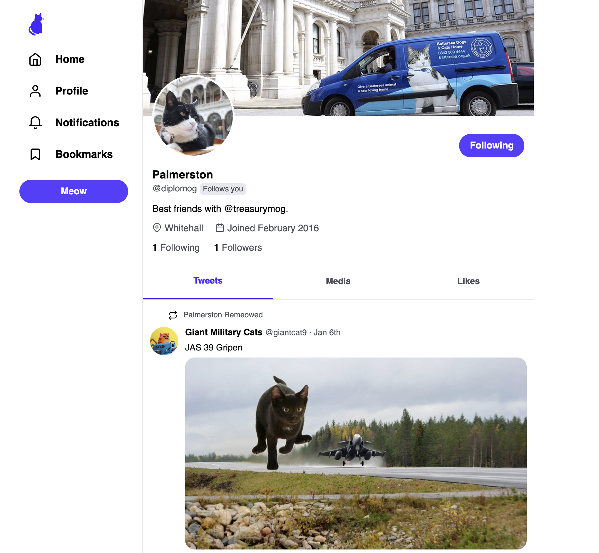

# Twitter project

This project asks you to create a Twitter clone, "Critter":

Your focus will be on the front-end: an API is provided, and documented in `server/DOCS.md`. You can read this document thoroughly to build an understanding of what the different endpoints are, and how they work.

## Initial setup

A folder is provided, `/server`, with the backend code. You'll need to create the front-end using `create-react-app`. Run the following from within the main workshop directory:

```bash
npx create-react-app client
```

This will create a brand-new React application. You can `cd` into this directory and install some dependencies you'll need:

- styled-components
- react-router-dom
- react-icons-kit
- date-fns

After they're installed, you can run `yarn start` to start the front-end application.

You can find instructions for running the server application in `server/DOCS.md`

The cat silhouette logo is provided in `assets/logo.svg`

## Functionality

Your application should include the following features:

### View a single tweet


When the user navigates to `/tweet/:tweetId`, they should see the details for the specified tweet.

### View a "home feed"

When navigating to the root URL `/`, the user should see a list of tweets from the accounts that the current user follows.


### View a profile page

When navigating to `/:profileId`, information about that user is displayed, above a list of that user's tweets (and retweets):



### Liking a tweet

When clicking the "like" button, it should increment the # of likes. Clicking again should "unlike" the tweet.


### Posting a new tweet

On the homepage, the user should be able to create a new tweet by writing in the box and clicking "Meow":


It should show up in the feed below after posting.

# Additional goals

There are many stretch goals that are _not required._ They are described in more detail in `STRETCH.md`. Specifically, things you **don't** need to worry about include:

- Any other pages, like "Notifications" and "Bookmarks". These navigation items are purely for show.
- The "Meow" button in the sidebar.
- Anything to do with retweeting
- Replying to tweets
- The other tabs on the profile page (Media / Likes)
- Attaching media to new tweets
- The "share" / "upload" button on tweets (only the "like" button should do anything)

# Getting started

There are many valid ways to accomplish this project. The following is just one example of a way this could work.

First thing's first, the create-react-app code includes some placeholder content. We can delete most of it. We'll keep `src/index.js` and `src/App.js`, though let's turn App into a clean slate:

```js
import React from 'react';

const App = () => {
  return <div>Hello world</div>;
};
```

Next, let's create some top-level components. We won't actually be creating views for the "Bookmarks" and "Notifications" shown in the sidebar, but we'll create placeholders for them. Create the following components, each in their own file:

- `HomeFeed`
- `Notifications`
- `Bookmarks`
- `TweetDetails`
- `Profile`

Each of these components can start as a placeholder, like `App`:

```js
const HomeFeed = () => {
  return <div>Home Feed</div>;
};
```

Next, let's add routes to all of these components! Import React Router, add a `<Switch>`, and add the following routes:

- `/` (home route)
- `/notifications` (notifications route. We won't be building this view, but let's add the route anyway.)
- `/bookmarks` (another route we won't do much with)
- `/tweet/:tweetId` (tweet route)
- `/:profileId` (profile route)

> It's important to put them in this order, within a Switch. **`/:profileId` should come last!** This is because it's the "loosest" route; `/notifications` _could_ match, since maybe there's a user with the username "notifications"

Next, let's start work on the layout. Create a `Sidebar` component. We'll need the cat logo shown in the top left, which we can copy from `assets/logo.svg` (in the root directory of this workshop) into `src/assets`. Import it, and create links for all the navigation items in the sidebar, using React Router `<Link>`. For the `Profile` link, for now you can use a dummy profile ID (eg. `/profile/abc`).

Use CSS to position the sidebar beside all the routes.

**Don't worry too much about getting the styling exactly right.** You can polish it up later. For now, we just want to build the skeleton and get all the rough pieces in place.

You should now be able to click between different links in the sidebar, toggling between different views on the right.

---

Next, we need to get information about the current user!

The API makes information available at `/me/profile`. We'll want to fetch the data from the API, and store it in React state. We'll make that state available anywhere in the app using Context.

Create a new component, `CurrentUserContext`. Refer to the Context lectures and workshops for a refresher on how context components work. We'll want to use the `fetch` API, and store the data we receive.

The thing is, for the first second or so, we don't know who the user is, and this actually makes things more complicated! For example, the sidebar features a link to "Profile", which is meant to be a link to the current user's profile; if we don't know who the user is, we can't very well link to their profile!

We need a _loading state_.

You can either use two state hooks, or a reducer hook; the choice is yours. Here's how two state hooks could be set up:

```js
export const CurrentUserProvider = ({ children }) => {
  const [currentUser, setCurrentUser] = React.useState(null);
  const [status, setStatus] = React.useState('loading');

  // Fetch the user data from the API (/me/profile)
  // When the data is received, update currentUser.
  // Also, set `status` to `idle`

  return (
    <CurrentUserContext.Provider value={{ currentUser, status }}>
      {children}
    </CurrentUserContext.Provider>
  );
};
```

You can wrap the provider around the app in `src/index.js`, and consume it in `App`. If the `status` is `loading`, we can show a loading message instead of rendering all the routes.

---

At this point, we have our routes, we have our user, and an example of data fetching. These are the patterns we'll want to rely on as we continue building out the app!

As a next step, you can start working on the index "home feed" route. Go through the API documentation to find the right API endpoint, and update the `HomeFeed` component to fetch the data and use the results to render an array of Tweets. You'll need to create a Tweet component that takes the data for a single Tweet, and renders the appropriate UI.

Again, don't worry too much on the styling at first. More important to get the logic working.

Beyond that, it's up to you to keep putting the app together, 1 component at a time!
